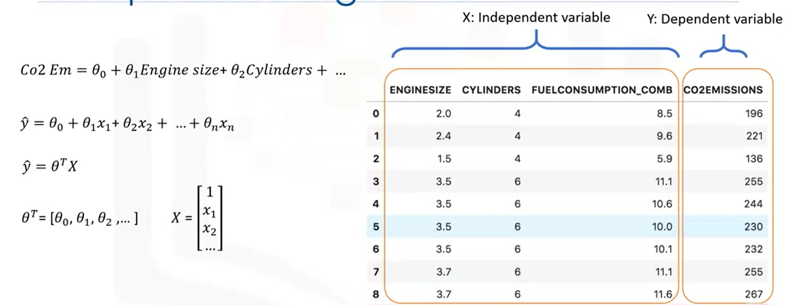

# Multiply Linear Regression

## Problem Set Up

## Optimized paramters

Short Definition: The ones that lead to the model with the fewest errors

MSE : How bad the model represents the real data

### How to estimate theta?

* Ordinary least squares
  * Linear algebra operations \(Take long time\)
* Optimization algorithm
  * Gradient descent
  * Proper approach for large dataset

